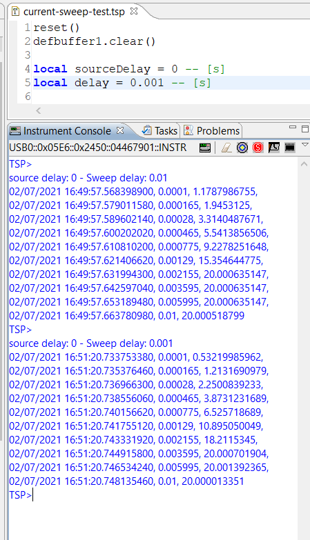
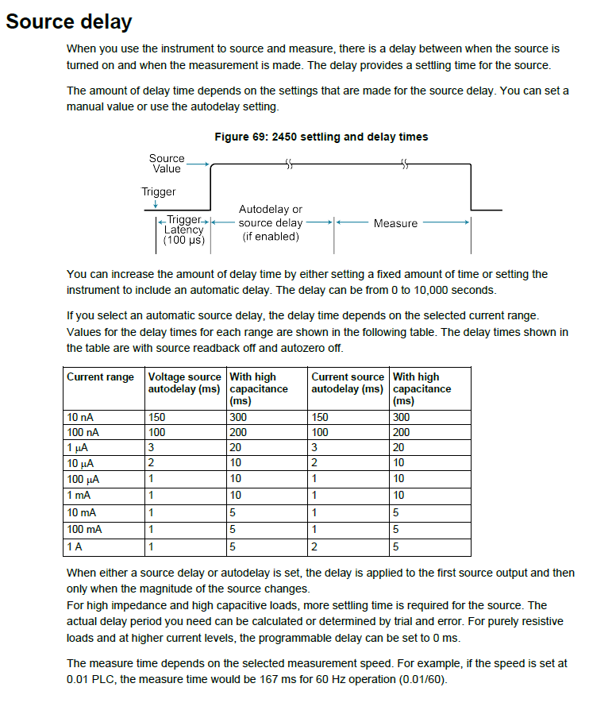

# Current Sweep Speed Test

How fast is the instrument? How many measurements can be made every second? What is the minimum time interval between two measurements?

With the [current seep test tsp script](../current-sweep-speed-test/current-sweep-test.tsp) you can push the instrument to it's maximum speed.

The time interval between two measurement is the sum of five elements: 

 1. Trigger Latency
 2. Explict source delay or implicit source autodelay 
 3. Measure time (NPLC)
 4. Sweep delay
 5. Time consumed by autorange and autozero functions

All but trigger latency can be influenced by user configurable parameters.

 The following configuration allow for maximun speed:

```lua

-- setting for maximum speed 
smu.source.delay=0
smu.source.readback = smu.OFF
smu.measure.nplc = 0.01
smu.measure.autozero.enable = smu.OFF
smu.measure.autozero.once()

```

`smu.source.readback = smu.ON` mean that the output of the measure will include the measured source singal levels while with `smu.source.readback = smu.OFF` the programmed value is used. The source signal measure is executed immidiatly before the measure signal measuremnt. This additional measure require some time and increase the overall time required for each messuremt.

`smu.source.delay=0` allow to control the delay between two measures only with `delay` paramer `function`.

NPLC Set the amount of time that the input signal is measured is specified in parameters that are based on the number of power line cycles (NPLCs). Lower NPLC settings result in faster reading rates, but increased noise. Higher NPLC settings result in lower reading noise, but slower reading rates. Each power line cycle for 60 Hz is 16.67 ms (1/60); for 50Hz, it is 20 ms (1/50).

## Experimental Results

The experiment has been repeted with various combination of NPLC and delay parameters.

- [results with 10K resistive load](../current-sweep-speed-test/current_sweep_test_R10K_LOAD.txt)
- [results with RC load](../current-sweep-speed-test/current_sweep_test_RC_LOAD.txt)


Reducing delay to 10ms (0.01s) there is some jittering on the measurement interval


When we try to set a 1ms delay we get a measurement interval that is longer than 1ms.



## Conclusions

With Keithley 2450 the minimum time interval between two measurement is between 1 and 2 ms. This is compatilbe with section in the reference manual "source delay" in reference manual. (page 4-46)
