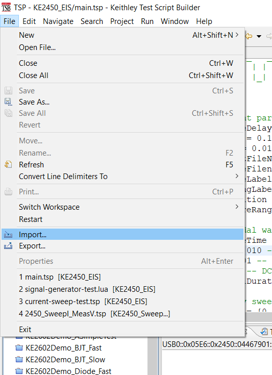
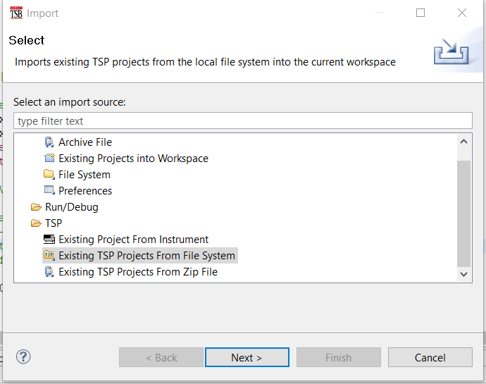
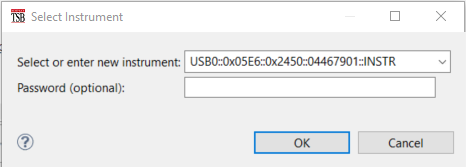

# Getting Started

## Step1: Import Project in TSP Builder

1. Connect an empty USB storage device to save exeperiment result
2. Open the projet import wizard 
3. Select "Existing TSP Project from filesystem" 
4. Locate the KE2450_EIS folder from this repository 

## Step2: Configure experiment prameters

To perform an EIS analysis using this software package edit the configurable parameters in the “experiment parameters” section of `TspBuilder/KE2450_EIS/main.tsp`. 

```lua
-- sampling
local sourceDelay = 0 -- [s]
local delay = 0.005 -- [s]
local nplc = 0.01 -- range from 0.01 to 10 , default 1

-- instrument range settings
local measureRange = 5 --[V]  The fixed voltage source ranges are  20 mV, 200 mV, 2 V, 20 V, and 200 V.
local sourceRange = 0.010 --[A] The fixed current source ranges are 10 nA, 100 nA, 1 microA, 10 microA, 100 microA, 1 mA, 10 mA, 100 mA, and 1 A

-- output files 
local sourceLabel = "Current"
local readingLabel = "Voltage"
local resultFileNamePrefix = "test_battery_readback_10ms_10ma_autoOFF_nplc_05"
local sourceFilenamePrefix = "generatedCurrent_battery_10ms_10ma_autoOFF_nplc_05"

--  source sinusoidal waveform parameters
local repetition = 1
local sampleTime = delay -- output signal sampling period [s]
local A = 0.010 -- current signal amplitude [A]
local po=0.01 -- phase offset
local b = 0 -- DC bias
local signalDuration = 100 -- seconds 100

-- frequency sweep
local sweep = {0.05,0.1,0.2,0.4,1,2,4,10,20,40}

```

## Step3: Electrical connection

Then, the four-wire connection of the DUT must be performed and the program must be executed on the instrument according to the instrument manual. Depending on the specific device capability and setup, the script must be loaded locally or executed from a remote control PC.

## Step4: Run the voltage and current measurement script

TSP Builder allow for remote instrument operation over USB or ethernet connection. See instrument manual for configuration. 


The current active file can executed on the instrument from TSBBuilder


You can also copy the script in a USB storage device and the load the script using ScripManager and run.
Result file will be saved in the same USB drive.
